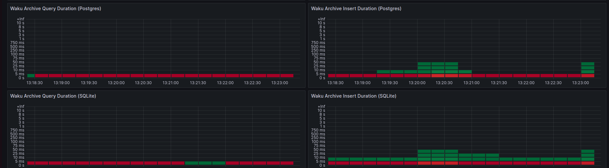

## Summary

The docker compose starts two nwaku nodes with the Store protocol mounted but
one is connected to SQLite and the other to Postgres. The performance can be
compared through grafana.

## Details

The two nodes are interconnected.

Grafana dashboard helps to compare performance

Within the docker compose we define another entities that make the
nwaku nodes to send messages between them, and therefore, each received
message is stored. On the other hand, another container(s) perform _Store_
requests.
